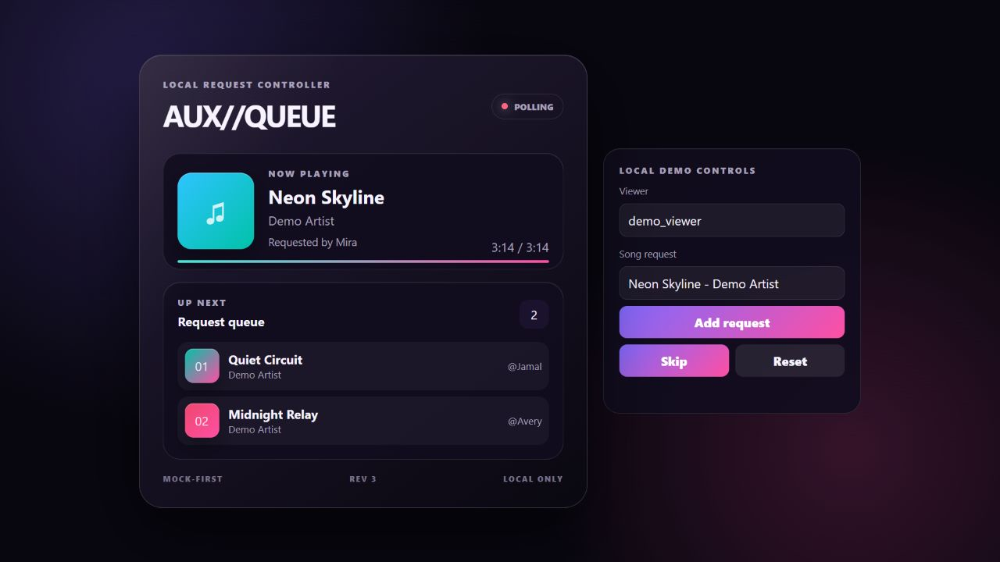
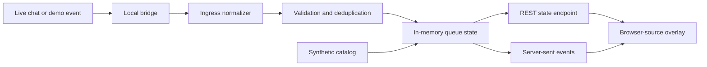

# Live Music Request Orchestrator

A local-first controller that turns live-chat commands into a normalized,
deduplicated request queue and an OBS-ready browser overlay.



The runnable demo uses deterministic track metadata, so reviewers can exercise
the queue, overlay, and event pipeline without an account, API key, external
service, or copyrighted audio. It renders request metadata; it does not play or
stream music.


## Try it locally

Requirements: Git and Python 3.11 or newer. No API keys are required.

```text
git clone https://github.com/soin8293/live-music-request-orchestrator.git
cd live-music-request-orchestrator
python -m venv .venv
```

Activate the environment on Windows PowerShell:

```powershell
.\.venv\Scripts\Activate.ps1
```

Or on macOS/Linux:

```bash
source .venv/bin/activate
```

Install and start the controller:

```text
python -m pip install .
live-music-orchestrator
```

Open <http://127.0.0.1:5000/?controls=1>, enter a requester and song, and use
**Add request**, **Skip**, and **Reset**. The plain overlay for an OBS Browser
Source is <http://127.0.0.1:5000/>.

For release downloads, TikFinity setup, every environment variable, and
troubleshooting, see the [complete setup guide](docs/setup.md).

## Credentials and integrations

| Use case | What is required |
|---|---|
| Local demo and overlay | Nothing: no account and no API key |
| OBS Browser Source | OBS only; point it at the local overlay URL |
| Optional TikFinity bridge | A locally running TikFinity WebSocket; no provider key is read by this project |
| Access from another computer | A self-generated `ORCHESTRATOR_INGEST_TOKEN` and deliberate network configuration |
| Spotify, YouTube, Twitch, or other playback APIs | Not implemented in this repository |

`ORCHESTRATOR_INGEST_TOKEN` is a shared secret you create yourself, not an API
key obtained from a music or streaming provider. The default loopback setup does
not need it. Copy `.env.example` to `.env` only when you need to change defaults.

## What it demonstrates

- A canonical command contract across snake-case, camel-case, and raw chat input
- Idempotent duplicate suppression for retried or double-fired events
- Queue bounds, request-length bounds, and explicit rejection reasons
- Requester attribution carried through the state model
- Same-origin REST plus server-sent-event delivery to a responsive browser overlay
- Mock-first execution with no accounts, API keys, or external services required
- Loopback-only mutation by default and token-gated non-loopback operation
- Unit/API tests and a Python 3.11–3.13 CI matrix

## Review the engineering

| Evidence | Verified result | Where to inspect it |
|---|---|---|
| Behavior | 21 deterministic unit/API tests | [`tests/`](tests/) |
| Coverage | At least 80% package coverage, enforced in CI | [CI workflow](.github/workflows/ci.yml) |
| Compatibility | Python 3.11, 3.12, and 3.13 | [GitHub Actions](https://github.com/soin8293/live-music-request-orchestrator/actions) |
| Supply-chain boundary | Full-history Gitleaks scan and SHA-pinned actions | [CI workflow](.github/workflows/ci.yml) |
| Design reasoning | Architecture, tradeoffs, authorship, and limitations | [`docs/`](docs/) |

## Scope

This project orchestrates requests and renders metadata. It does **not** stream,
broadcast, download, redistribute, or play audio. Provider-specific playback
automation and real operational data are not included. Anyone connecting a
playback source is responsible for its terms, licensing, and broadcast rights.

## Architecture



See [the architecture notes](docs/architecture.md) and
[the engineering case study](docs/case-study.md) for the design decisions and
limitations.

## Send events directly

The interactive controls are the quickest demo. To exercise the ingress API
from another terminal instead, activate the same environment and run:

```powershell
python scripts/send_demo_event.py request --user demo_viewer --song "Neon Skyline - Demo Artist"
python scripts/send_demo_event.py request --user second_viewer --song "Quiet Circuit - Demo Artist"
python scripts/send_demo_event.py skip --user moderator
```

Canonical input:

```json
{
  "event_type": "CHAT_COMMAND",
  "action": "request",
  "username": "demo_viewer",
  "nickname": "Demo Viewer",
  "command_params": "Neon Skyline - Demo Artist",
  "source": "demo"
}
```

The normalizer also accepts the older `type` / `commandParams` form and raw
`!play`, `!request`, or `!skip` comment text. It emits one internal command
shape before any queue mutation occurs.

## Repository map

```text
src/live_music_orchestrator/
  app.py          Flask application and event stream
  bridge.py       Optional local TikFinity WebSocket bridge
  catalog.py      Deterministic synthetic metadata
  config.py       Environment-backed settings and exposure guard
  ingress.py      Multi-shape event normalization
  models.py       Typed commands and queue items
  events.py       In-process server-sent-event fan-out
  store.py        Thread-safe in-memory queue state machine
  web/            OBS-ready HTML, CSS, and JavaScript overlay
tests/            Unit and API tests
scripts/          Local demo-event helper
docs/             Setup, architecture, and case-study notes
```

## Development checks

```text
python -m pip install -e ".[dev]"
ruff check .
ruff format --check .
pytest --cov=live_music_orchestrator --cov-fail-under=80
```

## Privacy and safe operation

Keep the default loopback host for normal use. If you intentionally bind to a
LAN interface, the application requires `ORCHESTRATOR_INGEST_TOKEN`; that is
still not a substitute for production authentication or TLS. See
[SECURITY.md](SECURITY.md).

## Project status

`v0.1.2` is a functional controller-and-overlay release. The local demo and
project-owned interfaces are tested; third-party live connectors remain
environment-dependent and are not claimed as CI-verified.

See the [changelog](CHANGELOG.md), [contribution guide](CONTRIBUTING.md),
[provenance notice](NOTICE.md), and [complete setup guide](docs/setup.md).

## License

MIT. See [LICENSE](LICENSE).
