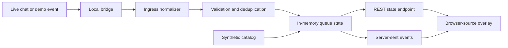

# Live Music Request Orchestrator

A local-first controller for turning live-chat commands into a normalized,
deduplicated request queue and an OBS-ready browser overlay.


_A verified local run using the deterministic synthetic catalog. No account,
viewer, or copyrighted-media data appears in the screenshot._

This repository is the sanitized public edition of a private system I built to
coordinate chat ingress, requester attribution, queue state, real-time overlay
updates, and playback-provider experiments during live sessions. The public
edition defaults to a deterministic synthetic catalog so it can be reviewed and
tested without credentials, private account data, or copyrighted audio.


## Review in two minutes

| Evidence | Verified result | Where to inspect it |
|---|---|---|
| Behavior | 21 deterministic unit/API tests | [`tests/`](tests/) |
| Coverage | 80% package coverage, enforced in CI | [CI workflow](.github/workflows/ci.yml) |
| Compatibility | Python 3.11, 3.12, and 3.13 | [GitHub Actions](https://github.com/soin8293/live-music-request-orchestrator/actions) |
| Supply-chain boundary | Full-history Gitleaks scan and SHA-pinned actions | [CI workflow](.github/workflows/ci.yml) |
| Design reasoning | Architecture, tradeoffs, authorship, and limitations | [`docs/`](docs/) |

## What it demonstrates

- A canonical command contract across snake-case, camel-case, and raw chat input
- Idempotent duplicate suppression for retried or double-fired events
- Queue bounds, request-length bounds, and explicit rejection reasons
- Requester attribution carried through the state model
- Same-origin REST plus server-sent-event delivery to a responsive browser overlay
- Mock-first execution with no accounts, API keys, or external services required
- Loopback-only mutation by default and token-gated non-loopback operation
- Unit/API tests and a Python 3.11–3.13 CI matrix

## Deliberate boundary

This project orchestrates requests and renders metadata. It does **not** stream,
broadcast, download, or redistribute audio. The public edition excludes the
private provider-specific playback integration and all real operational data.
Anyone connecting a playback source is responsible for its terms, licensing,
and broadcast rights.

## Architecture



See [the architecture notes](docs/architecture.md) and
[the engineering case study](docs/case-study.md) for the design decisions and
limitations.

## Run the local demo

Requirements: Python 3.11 or newer.

```text
python -m venv .venv
```

Activate it on Windows PowerShell:

```powershell
.\.venv\Scripts\Activate.ps1
```

Or on macOS/Linux:

```bash
source .venv/bin/activate
```

Then install and start the controller on any platform:

```text
python -m pip install -e ".[dev]"
live-music-orchestrator
```

Open:

- Overlay: `http://127.0.0.1:5000/`
- Interactive local demo: `http://127.0.0.1:5000/?controls=1`
- Health check: `http://127.0.0.1:5000/health`

Send synthetic events from another terminal:

```powershell
python scripts/send_demo_event.py request --user demo_viewer --song "Neon Skyline - Demo Artist"
python scripts/send_demo_event.py request --user second_viewer --song "Quiet Circuit - Demo Artist"
python scripts/send_demo_event.py skip --user moderator
```

Run the checks:

```text
ruff check .
ruff format --check .
pytest --cov=live_music_orchestrator --cov-fail-under=80
```

## Supported input shapes

Canonical input:

```json
{
  "event_type": "CHAT_COMMAND",
  "action": "request",
  "username": "demo_viewer",
  "nickname": "Demo Viewer",
  "command_params": "Neon Skyline - Demo Artist",
  "source": "demo"
}
```

The normalizer also accepts the older `type` / `commandParams` form and raw
`!play`, `!request`, or `!skip` comment text. It emits one internal command
shape before any queue mutation occurs.

## Optional TikFinity bridge

If TikFinity exposes its local WebSocket on `ws://127.0.0.1:21213/`, run:

```powershell
live-music-bridge
```

The bridge only forwards recognized commands. It does not log raw messages or
viewer identifiers. TikFinity is a third-party product and is not bundled.

## Repository map

```text
src/live_music_orchestrator/
  app.py          Flask application and event stream
  bridge.py       Optional local WebSocket bridge
  catalog.py      Deterministic synthetic metadata
  config.py       Environment-backed settings and exposure guard
  ingress.py      Multi-shape event normalization
  models.py       Typed commands and queue items
  events.py       In-process server-sent-event fan-out
  store.py        Thread-safe queue state machine
  web/            OBS-ready HTML, CSS, and JavaScript overlay
tests/            Unit and API tests
scripts/          Local demo-event helper
docs/             Architecture and case-study notes
```

## Privacy and safe operation

Keep the default loopback host for normal use. If you intentionally bind to a
LAN interface, the application requires `ORCHESTRATOR_INGEST_TOKEN`; that is
still not a substitute for production authentication or TLS. See
[SECURITY.md](SECURITY.md).

## Project status

`v0.1.1` is a portfolio-grade public reconstruction. The mock path and public
interfaces are tested; third-party live connectors remain environment-dependent
and are intentionally not claimed as CI-verified.

See the [changelog](CHANGELOG.md), [contribution guide](CONTRIBUTING.md), and
[provenance notice](NOTICE.md) for the public-development boundary.

## License

MIT. See [LICENSE](LICENSE).
