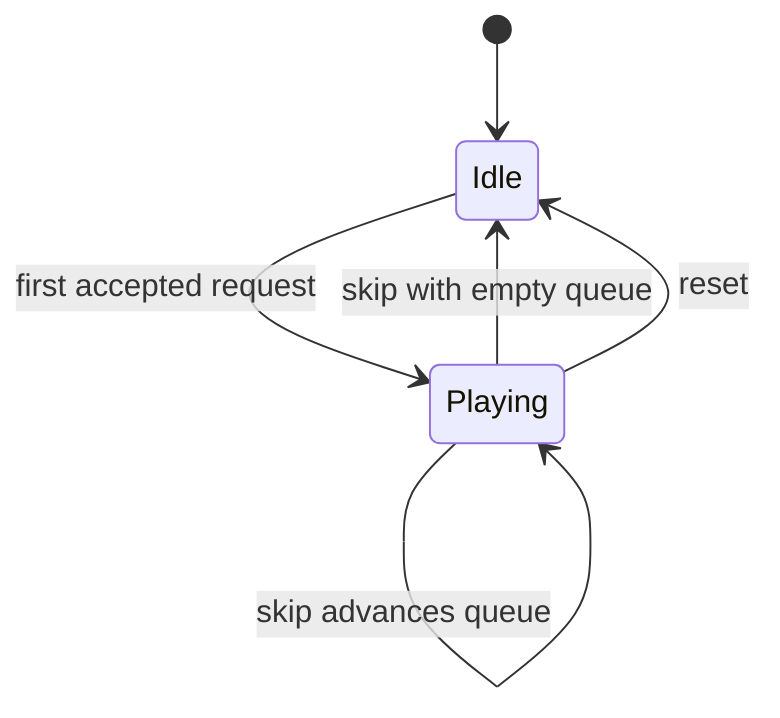

# Architecture

## Design goals

The system has to accept inconsistent third-party event shapes without letting
that inconsistency leak into queue logic. It also has to remain usable during
connector reconnects and duplicate deliveries, while keeping the browser-source
surface simple enough to debug during a live session.

The implementation therefore separates five concerns:

1. `ingress.py` converts supported payload shapes into `NormalizedCommand`.
2. `store.py` owns every queue mutation and rejection decision.
3. `catalog.py` produces deterministic synthetic metadata without a network.
4. `app.py` exposes same-origin REST and a native server-sent-event stream.
5. `web/` renders the canonical state without interpreting upstream payloads.

## State transition

## Idempotency

Two independent controls handle common double-delivery failure modes:

- a `(username, normalized query)` debounce window catches rapid retries;
- an active/queued-query check prevents the same normalized request from being
  inserted twice even after the debounce window.

Rejections are explicit API results (`debounced`, `already_queued`,
`queue_full`, or validation errors) rather than silent drops.

## Security boundary

The browser overlay and controller share one origin. No permissive CORS layer or
third-party browser client is required. Mutating routes are loopback-only unless
a configured shared token is present. The CLI refuses a non-loopback bind
without that token.

The public build keeps state in memory and logs only event type, source, result,
and queue length. Raw payloads and identities are excluded from logs.

## Extension seam

`SyntheticCatalog.resolve()` is the public provider seam. A lawful private
deployment can replace it with an adapter that returns the same `ResolvedTrack`
contract. Playback and media delivery are intentionally outside this repository.
